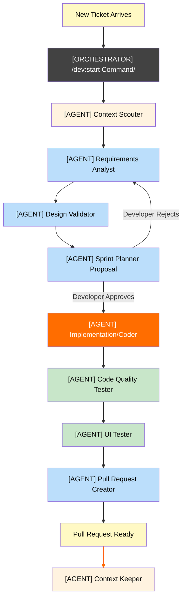

# Developer workflow

```mermaid
---
config:
  layout: dagre
---
flowchart TB
    A["New Ticket Arrives"] --> B["[ORCHESTRATOR] /dev:start Command/"]
    B --> L["[AGENT] Context Scouter"]
    L --> C["[AGENT] Requirements Analyst"]
    C --> D["[AGENT] Design Validator"]
    D --> E["[AGENT] Sprint Planner Proposal"]
    E -- Developer Approves --> F["[AGENT] Implementation/Coder"]
    F --> G["[AGENT] Code Quality Tester"]
    G --> H["[AGENT] UI Tester"]
    H --> I["[AGENT] Pull Request Creator"]
    I --> J["Pull Request Ready"]
    J --> K["[AGENT] Context Keeper"]
    E -- Developer Rejects --> C

    style A fill:#FFF9C4,color:#000000
    style B fill:#424242,color:#ffffff
    style L fill:#FFF3E0,color:#000000
    style C fill:#BBDEFB,color:#000000
    style D fill:#BBDEFB,color:#000000
    style E fill:#BBDEFB,color:#000000
    style F fill:#FF6D00,color:#ffffff
    style G fill:#C8E6C9,color:#000000
    style H fill:#C8E6C9,color:#000000
    style I fill:#BBDEFB,color:#000000
    style J fill:#FFF9C4,color:#000000
    style K fill:#FFF3E0,color:#000000
    linkStyle 10 stroke:#FF6D00,fill:none
```
